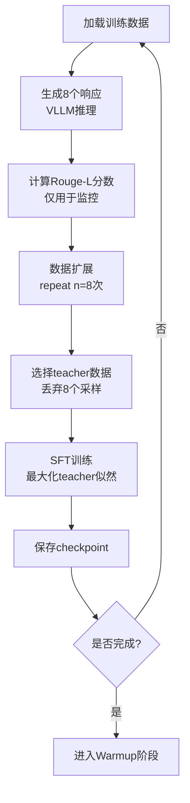

# SeqKD训练流程详解

## 一、概述

**SeqKD (Sequence Knowledge Distillation)** 是GAD训练的第一阶段，作为baseline。它使用GRPO框架的基础设施，但实际采用SFT策略训练。

**核心特点**：
- 生成多个响应用于监控，但训练时只使用teacher响应
- 为后续的对抗训练准备基础设施
- 通过Rouge-L评估生成质量

## 二、训练流程图



## 三、关键阶段详解

### 阶段1: 数据准备与生成

```
输入数据结构：
├── prompts: [p1, p2, ..., p32]              # 32个问题
└── teacher_response: [t1, t2, ..., t32]     # GPT-5的响应
```

**关键函数**：[actor_rollout_wg.generate_sequences()](cci:1://file:///d:/%E5%B7%A5%E4%BD%9C%E6%96%87%E4%BB%B6/RAG%E5%BC%80%E5%8F%91/Query_RL/Program/OPD/LMOps/gad/verl/verl/workers/fsdp_workers.py:1770:4-1850:27)

**作用**：使用VLLM引擎为每个prompt生成n=8个不同响应

**输出**：
```
生成结果：
├── prompts: [p1]*8 + [p2]*8 + ... (256个)
├── responses: [p1_r1, p1_r2, ..., p1_r8, ...] (256个采样)
└── teacher_response: [t1]*8 + [t2]*8 + ... (256个)
```

### 阶段2: 质量评估（仅验证阶段）

**关键函数**：`rouge_scorer.RougeScorer.score()`

**作用**：计算生成响应与teacher的相似度

**计算公式**：
```
Rouge-L = 2 × (Precision × Recall) / (Precision + Recall)
其中：
- Precision = LCS长度 / 生成响应长度
- Recall = LCS长度 / teacher长度
- LCS = 最长公共子序列
```

**用途**：
- ✅ 验证阶段：评估模型质量
- ✅ 日志记录：监控训练进度
- ❌ 训练阶段：不参与梯度计算

### 阶段3: 数据选择（核心差异）

**关键代码位置**：[dp_actor.py::update_policy()](cci:1://file:///d:/%E5%B7%A5%E4%BD%9C%E6%96%87%E4%BB%B6/RAG%E5%BC%80%E5%8F%91/Query_RL/Program/OPD/LMOps/gad/verl/verl/workers/actor/dp_actor.py:387:4-513:22)

**数据筛选**：
```python
select_keys = [
    "teacher_response",        # ← 只保留这些
    "teacher_input_ids",
    "teacher_attention_mask",
    "teacher_position_ids"
]
# 注意：responses（8个采样）被丢弃
```

**数据流转换**：
```
训练前：256个样本（32 prompts × 8 responses）
         ↓ 选择teacher相关字段
训练时：256个teacher样本（全部是teacher_response）
```

### 阶段4: SFT训练

**关键函数**：[compute_sft_loss()](cci:1://file:///d:/%E5%B7%A5%E4%BD%9C%E6%96%87%E4%BB%B6/RAG%E5%BC%80%E5%8F%91/Query_RL/Program/OPD/LMOps/gad/verl/verl/trainer/ppo/core_algos.py:634:0-641:18)

**损失计算**：
```
Loss = -mean(log P(teacher_token | context))
```

**训练目标**：最大化模型生成teacher响应的概率

**优化过程**：
```
1. 前向传播：model(teacher_input_ids) → logits
2. 计算log_prob：log P(teacher_response)
3. 计算损失：-mean(log_prob)
4. 反向传播：更新模型参数
5. 梯度裁剪：clip_grad_norm_(max_norm=0.2)
```

## 四、关键函数说明

### 1. [RayPPOTrainer.fit()](cci:1://file:///d:/%E5%B7%A5%E4%BD%9C%E6%96%87%E4%BB%B6/RAG%E5%BC%80%E5%8F%91/Query_RL/Program/OPD/LMOps/gad/verl/verl/trainer/ppo/ray_trainer.py:956:4-1145:26)
- **位置**：[ray_trainer.py](cci:7://file:///d:/%E5%B7%A5%E4%BD%9C%E6%96%87%E4%BB%B6/RAG%E5%BC%80%E5%8F%91/Query_RL/Program/OPD/LMOps/gad/verl/verl/trainer/ppo/ray_trainer.py:0:0-0:0)
- **作用**：主训练循环，协调各个训练阶段
- **流程**：加载checkpoint → 验证 → 训练循环 → 保存

### 2. [actor_rollout_wg.generate_sequences()](cci:1://file:///d:/%E5%B7%A5%E4%BD%9C%E6%96%87%E4%BB%B6/RAG%E5%BC%80%E5%8F%91/Query_RL/Program/OPD/LMOps/gad/verl/verl/workers/fsdp_workers.py:1770:4-1850:27)
- **位置**：[fsdp_workers.py](cci:7://file:///d:/%E5%B7%A5%E4%BD%9C%E6%96%87%E4%BB%B6/RAG%E5%BC%80%E5%8F%91/Query_RL/Program/OPD/LMOps/gad/verl/verl/workers/fsdp_workers.py:0:0-0:0)
- **作用**：使用VLLM生成多个响应
- **配置**：temperature=0.8, n=8, tensor_parallel=2

### 3. [actor_rollout_wg.update_actor()](cci:1://file:///d:/%E5%B7%A5%E4%BD%9C%E6%96%87%E4%BB%B6/RAG%E5%BC%80%E5%8F%91/Query_RL/Program/OPD/LMOps/gad/verl/verl/workers/fsdp_workers.py:601:4-643:21)
- **位置**：[fsdp_workers.py](cci:7://file:///d:/%E5%B7%A5%E4%BD%9C%E6%96%87%E4%BB%B6/RAG%E5%BC%80%E5%8F%91/Query_RL/Program/OPD/LMOps/gad/verl/verl/workers/fsdp_workers.py:0:0-0:0)
- **作用**：调用actor的update_policy进行训练
- **功能**：管理模型加载/卸载、计算性能指标

### 4. [actor.update_policy()](cci:1://file:///d:/%E5%B7%A5%E4%BD%9C%E6%96%87%E4%BB%B6/RAG%E5%BC%80%E5%8F%91/Query_RL/Program/OPD/LMOps/gad/verl/verl/workers/actor/dp_actor.py:387:4-513:22)
- **位置**：[dp_actor.py](cci:7://file:///d:/%E5%B7%A5%E4%BD%9C%E6%96%87%E4%BB%B6/RAG%E5%BC%80%E5%8F%91/Query_RL/Program/OPD/LMOps/gad/verl/verl/workers/actor/dp_actor.py:0:0-0:0)
- **作用**：执行实际的参数更新
- **流程**：数据分批 → 前向传播 → 损失计算 → 反向传播

### 5. [compute_sft_loss()](cci:1://file:///d:/%E5%B7%A5%E4%BD%9C%E6%96%87%E4%BB%B6/RAG%E5%BC%80%E5%8F%91/Query_RL/Program/OPD/LMOps/gad/verl/verl/trainer/ppo/core_algos.py:634:0-641:18)
- **位置**：[core_algos.py](cci:7://file:///d:/%E5%B7%A5%E4%BD%9C%E6%96%87%E4%BB%B6/RAG%E5%BC%80%E5%8F%91/Query_RL/Program/OPD/LMOps/gad/verl/verl/trainer/ppo/core_algos.py:0:0-0:0)
- **作用**：计算监督微调损失
- **公式**：`-mean(log_prob * mask)`

### 6. [compute_response_mask()](cci:1://file:///d:/%E5%B7%A5%E4%BD%9C%E6%96%87%E4%BB%B6/RAG%E5%BC%80%E5%8F%91/Query_RL/Program/OPD/LMOps/gad/verl/verl/trainer/ppo/ray_trainer.py:182:0-203:51)
- **位置**：[ray_trainer.py](cci:7://file:///d:/%E5%B7%A5%E4%BD%9C%E6%96%87%E4%BB%B6/RAG%E5%BC%80%E5%8F%91/Query_RL/Program/OPD/LMOps/gad/verl/verl/trainer/ppo/ray_trainer.py:0:0-0:0)
- **作用**：提取响应部分的attention mask
- **用途**：确保只计算响应token的损失

## 五、配置参数解析

### 核心配置
```yaml
algorithm:
  adv_estimator: grpo          # 使用GRPO框架（但不用其优势计算）

data:
  train_batch_size: 256        # 32 prompts × 8 = 256
  max_prompt_length: 2048
  max_response_length: 1536

actor:
  lr: 5e-6                     # 学习率
  grad_clip: 0.2               # 梯度裁剪
  ppo_mini_batch_size: 256     # mini-batch大小
  use_dynamic_bsz: True        # 动态批处理
  ppo_max_token_len_per_gpu: 20480

rollout:
  name: vllm                   # 使用VLLM引擎
  temperature: 0.8             # 采样温度
  n: 8                         # 每个prompt生成8个响应
  tensor_model_parallel_size: 2

trainer:
  total_epochs: 4
  save_freq: 50
  test_freq: 50
  critic_warmup: 10            # 前10步不更新actor
```

## 六、数据流示意图

```
┌─────────────────────────────────────────────────────────┐
│ Step 1: 数据加载                                         │
│ Input: 32 prompts + 32 teacher_responses                │
└────────────────────┬────────────────────────────────────┘
                     │
                     ▼
┌─────────────────────────────────────────────────────────┐
│ Step 2: VLLM生成 (n=8)                                  │
│ Output: 256 responses (32×8)                            │
│ 用途: 监控质量，不参与训练                                │
└────────────────────┬────────────────────────────────────┘
                     │
                     ▼
┌─────────────────────────────────────────────────────────┐
│ Step 3: 数据扩展                                         │
│ batch = batch.repeat(n=8)                               │
│ 结果: 256个样本（包含responses和teacher_response）        │
└────────────────────┬────────────────────────────────────┘
                     │
                     ▼
┌─────────────────────────────────────────────────────────┐
│ Step 4: 选择teacher数据                                  │
│ select_keys = ["teacher_response", ...]                │
│ ⚠️ 关键: 丢弃8个采样的responses                          │
└────────────────────┬────────────────────────────────────┘
                     │
                     ▼
┌─────────────────────────────────────────────────────────┐
│ Step 5: SFT训练                                          │
│ Loss = -mean(log P(teacher_response))                   │
│ 目标: 让模型学会生成teacher的响应                         │
└─────────────────────────────────────────────────────────┘
```

## 七、与标准GRPO的对比

| 特性 | SeqKD (本实现) | 标准GRPO |
|------|---------------|----------|
| **生成响应数** | 8个 | 8个 |
| **奖励计算** | Rouge-L（仅监控） | 用于优势计算 |
| **优势估计** | ❌ 不使用 | ✅ 组内相对优势 |
| **训练数据** | 只用teacher | 使用8个采样 |
| **损失函数** | SFT损失 | 策略梯度损失 |
| **训练目标** | 模仿teacher | 最大化相对优势 |

## 八、为什么这样设计？

### 1. 渐进式训练策略
```
Stage 0 (SeqKD) → Stage 1 (Warmup) → Stage 2 (GAD)
   稳定基线          训练判别器        对抗训练
```

### 2. 基础设施准备
- GRPO框架支持多响应生成
- 为后续GAD训练提供统一接口
- 代码复用，降低维护成本

### 3. 质量监控
- Rouge-L分数追踪训练进度
- 验证模型是否学习到正确模式
- 为超参数调优提供依据

## 九、输出与检查点

### 保存内容
```
/tmp/${EXP_NAME}/
├── global_step_50/
│   ├── actor/              # Actor模型权重
│   ├── data.pt             # DataLoader状态
│   └── ...
├── global_step_100/
└── latest_checkpointed_iteration.txt
```

### 日志指标
- `actor/pg_loss`: SFT损失
- `actor/teacher_pg_loss`: Teacher损失（同上）
- `actor/lr`: 当前学习率
- `actor/grad_norm`: 梯度范数
- `val/rouge-L/mean`: 验证集Rouge-L分数

## 十、总结

SeqKD阶段是一个**使用GRPO基础设施的纯SFT训练**：

✅ **做了什么**：
- 生成多个响应用于质量评估
- 使用teacher响应进行监督训练
- 为后续对抗训练准备模型

❌ **没做什么**：
- 不使用GRPO的优势计算
- 不使用8个采样结果训练
- 不进行强化学习优化

🎯 **目的**：
- 提供性能baseline
- 训练稳定的初始模型
- 为GAD对抗训练打基础