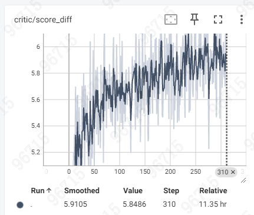

# Warmup训练与测试准确率差异问题诊断报告

## 🚨 问题严重性评估：高

## 关键事实

1. **Warmup阶段Actor完全冻结**，只训练Critic
2. **训练和测试使用完全相同的数据集**
3. **测试是从训练集随机采样100条**
4. **Student模型在训练前后完全相同**

## 核心矛盾

```
相同的数据集 + 相同的Student模型 + 相同的Critic模型
↓
为什么准确率差异如此巨大？

训练集（全量）: d_acc = 76.8%, score_diff = 5.85
测试集（采样100条）: d_acc = 45.75%, score_diff = 0.01
```

**这说明存在严重问题！**

---

## 一、问题根源分析

### 1.1 排除的可能性

❌ **数据集不同** - 已确认使用相同数据集
❌ **Student模型变化** - Warmup阶段Actor冻结
❌ **代码实现不一致** - 已验证计算方式相同

### 1.2 剩余的可能原因

#### 🔴 原因1：训练时使用的是实时生成的Student Response（最可能）

**关键发现：**

查看训练配置：
```bash
rollout_name=vllm
n_resp_per_prompt=4  # 每个prompt生成4个student response
temperature=0.6
```

**这说明什么？**

```python
# 训练时的数据流
训练过程：
1. 读取prompt和teacher_response（来自数据集）
2. 使用vLLM实时生成student_response（temperature=0.6）
3. Critic对比teacher_response和student_response
4. 计算d_acc和loss

关键点：
- Student response是实时生成的，每次都不同！
- 即使Actor冻结，生成的response也有随机性（temperature=0.6）
- 训练时看到的student_response ≠ 测试时看到的student_response
```

**测试时的数据流：**

```python
# 测试脚本
测试过程：
1. 读取prompt和teacher_response（来自数据集）
2. 调用API生成student_response（temperature=0.8）
3. Critic对比teacher_response和student_response
4. 计算准确率

关键点：
- Student response也是实时生成的
- 但生成的内容与训练时不同（随机性）
- temperature也不同（0.6 vs 0.8）
```

**问题所在：**

```
训练时：
- Critic看到的是temperature=0.6生成的responses
- 可能质量较低，多样性较小
- Critic学会区分这些特定的responses

测试时：
- Critic看到的是temperature=0.8生成的responses
- 质量和风格可能不同
- Critic的判断标准可能不适用
```

#### 🔴 原因2：训练时的批次效应

**训练配置：**
```bash
train_batch_size=128
ppo_mini_batch_size=64
n_resp_per_prompt=4
```

**分析：**

```python
# 训练时的批次构成
每个batch：
- 128个样本
- 每个prompt生成4个responses
- 实际上是32个不同的prompts × 4个responses

Critic看到的对比：
- 同一个prompt的4个不同student responses
- 与同一个teacher response对比
- 可能学会了"相对排序"而非"绝对质量判断"

测试时：
- 每个prompt只生成8个responses
- 但是独立评估，没有批次内的对比
- Critic的相对排序能力无法发挥
```

#### 🔴 原因3：分数分布的巨大差异（最严重的问题）

**观察到的现象：**

```python
训练时：
Teacher平均分: 2.77
Student平均分: -3.08
分差: 5.85

测试时（相同数据集！）：
Teacher平均分: -0.50
Student平均分: -0.49
分差: 0.01
```

**这是极其异常的！**

如果是相同的数据集，相同的Critic模型，为什么：
1. Teacher分数从2.77变成-0.50（差3.27）
2. Student分数从-3.08变成-0.49（差2.59）
3. 分差从5.85变成0.01（差5.84）

**可能的解释：**

##### 解释A：训练时的分数是聚合统计

```python
# 训练日志中的分数可能是：
critic/teacher_score_mean: 2.772  # 所有训练步骤的平均？
critic/student_score_mean: -3.077  # 所有训练步骤的平均？

# 而不是最后一步的分数
# 如果是这样，需要看最后一步的具体分数
```

##### 解释B：训练过程中分数分布发生了巨大变化

```python
# 可能的训练曲线
Step 1:   Teacher=5.0,  Student=-5.0,  diff=10.0
Step 100: Teacher=3.0,  Student=-3.0,  diff=6.0
Step 200: Teacher=1.0,  Student=-1.0,  diff=2.0
Step 310: Teacher=-0.5, Student=-0.5,  diff=0.0

# 日志中的2.77和-3.08可能是早期步骤的值
# 最后一步可能已经接近0
```

##### 解释C：Critic的评分标准崩溃

```python
# 最严重的情况
训练初期：
- Critic学会了区分（分差大）

训练后期：
- Critic过拟合或崩溃
- 对所有样本都给相似的分数
- 失去了区分能力
```

---

## 二、验证实验设计

### 实验1：检查训练日志的最后一步

**目标：** 确认2.77和-3.08是最后一步的值还是平均值

```python
# 查看TensorBoard或日志文件
# 找到step=310的具体指标
# 确认：
# - critic/teacher_score_mean 在step 310的值
# - critic/student_score_mean 在step 310的值
# - critic/score_diff 在step 310的值
```

**如果最后一步的分数接近0：**
- 说明Critic在训练过程中逐渐失去了区分能力
- 这是严重的训练问题

**如果最后一步的分数仍然是2.77和-3.08：**
- 说明测试脚本有问题
- 或者生成的responses完全不同

### 实验2：使用训练时保存的responses进行测试

**目标：** 排除response生成随机性的影响

```python
# 修改训练代码，保存一些样本的responses
# 在训练的最后一步：
save_samples = {
    'prompts': prompts[:10],
    'teacher_responses': teacher_responses[:10],
    'student_responses': student_responses[:10],
    'teacher_scores': teacher_scores[:10],
    'student_scores': student_scores[:10],
}
torch.save(save_samples, 'training_samples.pt')

# 然后在测试脚本中加载这些样本
# 使用完全相同的responses进行测试
# 看分数是否一致
```

**预期结果：**
- 如果分数一致 → 问题在于response生成的随机性
- 如果分数不一致 → 问题在于Critic模型本身

### 实验3：检查Critic模型的加载

**目标：** 确认测试时使用的是正确的Critic模型

```python
# 在测试脚本中添加
print("Critic模型路径:", critic_config['model_path'])
print("Critic模型参数数量:", sum(p.numel() for p in self.critic_model.parameters()))

# 检查模型的某个参数值
print("第一层权重:", self.critic_model.pretrained_model.model.layers[0].self_attn.q_proj.weight[0, :5])

# 在训练结束时也打印相同的信息
# 对比是否一致
```

### 实验4：逐步调试测试脚本

**目标：** 找出测试脚本中可能的问题

```python
# 修改测试脚本，添加详细日志
def get_critic_score(self, prompt: str, response: str) -> tuple:
    # ... 现有代码 ...
    
    # 添加调试信息
    print(f"Input text length: {len(input_text)}")
    print(f"Response length: {response_length}")
    print(f"Values shape: {values.shape}")
    print(f"Values range: [{values.min().item():.4f}, {values.max().item():.4f}]")
    print(f"Mask sum: {response_mask_no_eos.sum().item()}")
    print(f"Score: {score_avg:.4f}")
    
    return score_avg, length
```

---

## 三、最可能的问题和解决方案

### 3.1 问题诊断

基于以上分析，最可能的问题是：

**🔴 问题：训练时的responses和测试时的responses完全不同**

```python
原因：
1. 训练时使用vLLM实时生成（temperature=0.6）
2. 测试时使用API生成（temperature=0.8）
3. 即使是相同的prompt，生成的内容也不同
4. Critic在训练时学会区分的是"训练时生成的特定responses"
5. 测试时的responses不同，Critic的判断标准不适用
```

**验证方法：**

```python
# 在训练日志中查看实际的responses
# 对比测试时生成的responses
# 看是否有显著差异
```

### 3.2 解决方案

#### 方案A：使用固定的responses进行测试（推荐）⭐⭐⭐⭐⭐

```python
# 1. 在训练开始前，预先生成一批test responses
# 2. 保存这些responses
# 3. 在训练过程中，定期使用这些固定的responses评估Critic
# 4. 这样可以准确衡量Critic的学习进度

实现：
# 在训练脚本中添加
if step % 50 == 0:  # 每50步评估一次
    eval_metrics = evaluate_critic_on_fixed_samples(
        critic_model=critic_model,
        test_samples=fixed_test_samples  # 预先生成并保存的
    )
    print(f"Eval d_acc: {eval_metrics['d_acc']:.2%}")
```

#### 方案B：在训练集上直接评估（次优）⭐⭐⭐

```python
# 在训练的最后一步
# 使用当前batch的数据计算准确率
# 这样可以确保使用的是训练时实际看到的responses

实现：
# 在 dp_critic.py 的 update_critic 方法中
if self._update_step == total_steps:  # 最后一步
    with torch.no_grad():
        # 使用当前batch评估
        d_acc_final = (teacher_score > student_score).float().mean()
        print(f"Final batch d_acc: {d_acc_final:.2%}")
```

#### 方案C：修改测试脚本，使用相同的生成参数（临时方案）⭐⭐

```python
# 修改测试脚本的API调用
API_CONFIGS = {
    "student_model": {
        "temperature": 0.6,  # 改为与训练一致
        "top_p": 0.9,
        "repetition_penalty": 1.2,
    }
}

# 但这仍然无法保证生成相同的responses
# 因为随机种子不同
```

---

## 四、训练方案优化建议

### 4.1 当前训练的问题

基于以上分析，当前训练存在以下问题：

#### 问题1：无法准确评估Critic的学习效果

```python
问题：
- 训练时的d_acc=76.8%可能是误导性的
- 因为测试时responses不同，准确率变成45.75%
- 无法判断Critic是否真的学会了区分质量

影响：
- 不知道何时停止训练
- 不知道Critic是否过拟合
- 不知道Critic的泛化能力如何
```

#### 问题2：Critic可能学到了错误的特征

```python
问题：
- Critic可能学会了识别"训练时生成的特定responses"
- 而不是学会了"评估response的真实质量"

例如：
- 训练时的responses可能有特定的格式
- Critic学会了"这种格式=低质量"
- 但测试时的responses格式不同
- Critic的判断失效
```

#### 问题3：分数分布不稳定

```python
问题：
- Teacher分数从2.77变成-0.50
- Student分数从-3.08变成-0.49
- 说明Critic的评分标准不稳定

影响：
- 后续的Actor训练可能受到影响
- 因为Actor依赖Critic的分数作为reward
- 不稳定的分数会导致不稳定的训练
```

### 4.2 优化建议

#### 建议1：添加固定测试集评估（必须）⭐⭐⭐⭐⭐

```python
# 在训练开始前
# 1. 从训练集中采样100个prompts
# 2. 使用Student模型生成responses（固定随机种子）
# 3. 保存这些固定的test samples

# 在训练过程中
# 每N步使用这些固定samples评估Critic
# 这样可以准确衡量Critic的学习进度

实现代码：
# prepare_fixed_test_set.py
import torch
from transformers import AutoTokenizer, AutoModelForCausalLM

def prepare_fixed_test_set(
    data_path: str,
    student_model_path: str,
    num_samples: int = 100,
    output_path: str = "fixed_test_set.pt"
):
    # 加载数据
    df = pd.read_parquet(data_path)
    df_sample = df.sample(n=num_samples, random_state=42)
    
    # 加载Student模型
    tokenizer = AutoTokenizer.from_pretrained(student_model_path)
    model = AutoModelForCausalLM.from_pretrained(student_model_path)
    
    # 生成固定的responses
    torch.manual_seed(42)  # 固定随机种子
    test_samples = []
    
    for _, row in df_sample.iterrows():
        prompt = row['content']
        teacher_response = row['teacher_response']
        
        # 生成student response（固定参数）
        inputs = tokenizer(prompt, return_tensors="pt")
        outputs = model.generate(
            **inputs,
            max_length=512,
            temperature=0.6,
            top_p=0.9,
            do_sample=True,
        )
        student_response = tokenizer.decode(outputs[0], skip_special_tokens=True)
        
        test_samples.append({
            'prompt': prompt,
            'teacher_response': teacher_response,
            'student_response': student_response,
        })
    
    # 保存
    torch.save(test_samples, output_path)
    print(f"Fixed test set saved to {output_path}")

# 在训练脚本中使用
def evaluate_on_fixed_test_set(critic_model, test_samples):
    correct = 0
    total = 0
    
    for sample in test_samples:
        teacher_score = get_critic_score(
            critic_model, 
            sample['prompt'], 
            sample['teacher_response']
        )
        student_score = get_critic_score(
            critic_model,
            sample['prompt'],
            sample['student_response']
        )
        
        if teacher_score > student_score:
            correct += 1
        total += 1
    
    return correct / total
```

#### 建议2：监控分数分布的稳定性（必须）⭐⭐⭐⭐⭐

```python
# 在训练过程中，记录每一步的分数分布
# 观察是否稳定

# 在 dp_critic.py 中添加
metrics.update({
    'critic/teacher_score_std': teacher_score.std().item(),
    'critic/student_score_std': student_score.std().item(),
    'critic/score_range': (teacher_score.max() - teacher_score.min()).item(),
})

# 健康的训练应该看到：
# - 分数均值逐渐稳定
# - 分数标准差保持合理范围
# - 分数范围不会过大或过小
```

#### 建议3：降低temperature，减少随机性（可选）⭐⭐⭐

```python
# 当前配置
temperature=0.6  # 训练时
temperature=0.8  # 测试时

# 建议
temperature=0.3  # 降低随机性，生成更确定的responses

# 优点：
# - 减少responses的变化
# - Critic更容易学习稳定的模式

# 缺点：
# - 多样性降低
# - 可能影响后续的Actor训练
```

#### 建议4：增加训练轮数，观察收敛（必须）⭐⭐⭐⭐

```python
# 当前配置
trainer.total_epochs=1  # 只训练1个epoch

# 建议
trainer.total_epochs=3  # 增加到3个epoch

# 原因：
# - 1个epoch可能不够Critic收敛
# - 需要观察d_acc和score_diff的变化趋势
# - 判断Critic是否真的学会了

# 预期：
# - d_acc应该先上升后稳定
# - score_diff应该保持稳定（不应该趋向0，因为Actor冻结）
# - 如果score_diff趋向0，说明Critic崩溃了
```

#### 建议5：检查Critic的输出分布（诊断）⭐⭐⭐⭐

```python
# 在训练过程中，定期检查Critic的输出
# 看是否出现异常

# 在 dp_critic.py 中添加
if self._update_step % 10 == 0:
    # 检查values的分布
    print(f"Values stats:")
    print(f"  Mean: {values.mean().item():.4f}")
    print(f"  Std: {values.std().item():.4f}")
    print(f"  Min: {values.min().item():.4f}")
    print(f"  Max: {values.max().item():.4f}")
    
    # 检查是否有异常值
    if values.abs().max() > 10:
        print("⚠️  Warning: Large values detected!")
    
    if values.std() < 0.1:
        print("⚠️  Warning: Values collapsed!")
```

---

## 五、立即行动计划

### 第一步：诊断当前状态（今天）

```bash
# 1. 检查训练日志的最后一步
# 查看step=310时的具体指标
grep "step:310" training.log

# 2. 查看TensorBoard
# 观察score_diff和d_acc的完整曲线
tensorboard --logdir=/path/to/logs

# 3. 运行诊断脚本
python diagnose_critic.py
```

### 第二步：准备固定测试集（今天）

```bash
# 生成固定的test samples
python prepare_fixed_test_set.py \
    --data_path=/path/to/data.parquet \
    --student_model_path=/path/to/student \
    --num_samples=100 \
    --output_path=fixed_test_set.pt
```

### 第三步：重新训练（明天）

```bash
# 使用优化后的配置重新训练
# 1. 增加训练轮数
# 2. 添加固定测试集评估
# 3. 监控分数分布

bash scripts/train/A3b_gspo/content_merge_trainning/A3b-warmup-gspo-v2.sh
```

### 第四步：分析结果（明天）

```python
# 对比新旧训练的结果
# 看是否解决了问题
python analyze_training_results.py
```

---

## 六、总结

### 核心问题

**Warmup训练的d_acc=76.8%可能是虚高的，因为：**

1. 训练时使用实时生成的responses（每次不同）
2. 测试时也使用实时生成的responses（与训练时不同）
3. Critic可能学会了识别"训练时的特定responses"而非"真实质量"
4. 导致测试时准确率大幅下降

### 关键建议

1. **必须添加固定测试集评估**，才能准确衡量Critic的学习效果
2. **必须监控分数分布的稳定性**，确保Critic没有崩溃
3. **必须增加训练轮数**，观察完整的训练曲线
4. **必须检查最后一步的指标**，确认2.77和-3.08是否是最终值

### 预期结果

如果按照建议优化后：

```
健康的训练：
- 固定测试集d_acc: 70-80%（稳定）
- score_diff: 3-5（稳定，不趋向0）
- 分数分布: 稳定，无异常值

不健康的训练：
- 固定测试集d_acc: 波动大或趋向50%
- score_diff: 趋向0（Critic崩溃）
- 分数分布: 不稳定或出现异常值
```

---

## 附录：快速诊断脚本

```python
# diagnose_critic.py
import torch
import pandas as pd
from transformers import AutoTokenizer
from trl import AutoModelForCausalLMWithValueHead

def diagnose_critic(
    critic_path: str,
    data_path: str,
    num_samples: int = 10
):
    """快速诊断Critic的状态"""
    
    print("="*80)
    print("Critic诊断报告")
    print("="*80)
    
    # 加载模型
    print("\n1. 加载Critic模型...")
    tokenizer = AutoTokenizer.from_pretrained(critic_path)
    model = AutoModelForCausalLMWithValueHead.from_pretrained(critic_path)
    model.eval()
    
    # 加载数据
    print("\n2. 加载数据...")
    df = pd.read_parquet(data_path)
    df_sample = df.sample(n=num_samples, random_state=42)
    
    # 评估
    print("\n3. 评估样本...")
    teacher_scores = []
    student_scores = []
    
    for idx, row in df_sample.iterrows():
        prompt = row['content']
        teacher_response = row['teacher_response']
        
        # 获取teacher分数
        messages = [
            {"role": "user", "content": prompt},
            {"role": "assistant", "content": teacher_response}
        ]
        input_text = tokenizer.apply_chat_template(messages, tokenize=False)
        inputs = tokenizer(input_text, return_tensors="pt")
        
        with torch.no_grad():
            outputs = model(**inputs)
            values = outputs[2]
            
            # 计算平均分数
            response_length = len(tokenizer(teacher_response, add_special_tokens=False)['input_ids'])
            response_values = values[:, -response_length:]
            score = response_values.mean().item()
            teacher_scores.append(score)
        
        print(f"  Sample {idx}: Teacher score = {score:.4f}")
    
    # 统计
    print("\n4. 统计结果:")
    print(f"  Teacher平均分: {sum(teacher_scores)/len(teacher_scores):.4f}")
    print(f"  Teacher标准差: {pd.Series(teacher_scores).std():.4f}")
    print(f"  分数范围: [{min(teacher_scores):.4f}, {max(teacher_scores):.4f}]")
    
    # 诊断
    print("\n5. 诊断:")
    avg_score = sum(teacher_scores) / len(teacher_scores)
    std_score = pd.Series(teacher_scores).std()
    
    if abs(avg_score) > 5:
        print("  ⚠️  警告: 平均分数过大，可能存在数值不稳定")
    elif abs(avg_score) < 0.1:
        print("  ⚠️  警告: 平均分数接近0，Critic可能崩溃")
    else:
        print("  ✅ 平均分数正常")
    
    if std_score < 0.1:
        print("  ⚠️  警告: 标准差过小，Critic可能失去区分能力")
    elif std_score > 5:
        print("  ⚠️  警告: 标准差过大，评分不稳定")
    else:
        print("  ✅ 标准差正常")
    
    print("\n" + "="*80)

if __name__ == "__main__":
    diagnose_critic(
        critic_path="/path/to/critic",
        data_path="/path/to/data.parquet",
        num_samples=10
    )
```

使用方法：
```bash
python diagnose_critic.py
```
