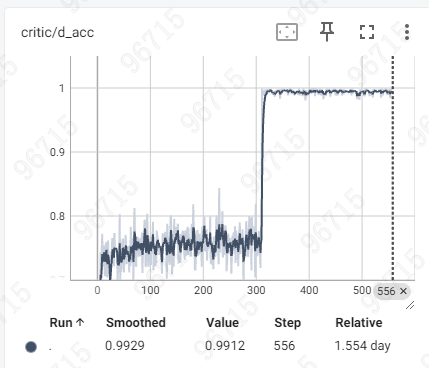

# 训练中 Critic 评估功能实现总结

## 📋 功能概述

实现了在训练过程中定期评估 Critic 模型打分能力的完整功能，核心特点：

✅ **直接使用 FSDP 切片模型** - 无需合并模型，直接使用训练中的 Critic 和 Actor  
✅ **自动化评估** - 在指定步数自动触发评估  
✅ **真实训练状态** - 使用当前训练中的 Actor 模型生成 student responses  
✅ **详细报告** - 生成准确率、分数分布等详细指标  
✅ **可视化支持** - 自动记录到 TensorBoard/WandB  

## 🗂️ 文件结构

### 核心代码

```
verl/verl/trainer/ppo/
├── critic_evaluator.py              # 评估器核心实现
└── critic_eval_integration.py       # 集成到训练流程的辅助函数
```

### 配置和文档

```
tools/
├── critic_eval_config_example.yaml  # 配置示例
└── test_critic_evaluator.py         # 测试脚本

CRITIC_EVALUATION_GUIDE.md           # 完整使用指南
训练中Critic评估功能实现总结.md      # 本文档
```

## 🔧 核心实现

### 1. CriticEvaluator 类

**文件**: `verl/verl/trainer/ppo/critic_evaluator.py`

**主要功能**:
- 管理评估数据集和配置
- 使用 Actor 模型生成 student responses
- 使用 Critic 模型对 teacher 和 student 打分
- 计算准确率和分数统计
- 保存详细评估结果

**关键方法**:

```python
class CriticEvaluator:
    def __init__(
        self,
        config,
        critic_module,      # 支持 FSDP 切片模型
        actor_module,       # 支持 FSDP 切片模型
        tokenizer,
        eval_data_path,
        eval_freq=100,
        ...
    )
    
    def should_evaluate(self, step: int) -> bool:
        """判断是否应该在当前步数评估"""
    
    def _generate_student_responses(self, prompts, n_responses):
        """使用 Actor 模型生成 student responses"""
    
    def _get_critic_scores_batch(self, prompts, responses):
        """批量获取 Critic 分数"""
    
    def evaluate(self, step: int) -> Dict[str, float]:
        """执行完整评估流程"""
```

**关键特性**:

1. **支持 FSDP 模型**:
```python
# 自动检测模型类型和设备
if hasattr(self.actor_module, 'pretrained_model'):
    if hasattr(self.actor_module.pretrained_model, 'hf_device_map'):
        device = list(self.actor_module.pretrained_model.hf_device_map.values())[0]
    else:
        device = next(self.actor_module.pretrained_model.parameters()).device
```

2. **与训练时一致的评分逻辑**:
```python
# 排除 EOS token，计算平均分数（与训练时完全一致）
eos_token_id = self.tokenizer.eos_token_id
is_eos = (response_ids == eos_token_id)
response_mask_no_eos = response_mask & (~is_eos)

values_sum = (values * response_mask_no_eos).sum(dim=-1)
length = response_mask_no_eos.sum(dim=-1).clamp(min=1)
score_avg = (values_sum / length).item()
```

3. **混合 batch 结构**（与训练时一致）:
```python
# 先添加所有 teachers，再添加所有 students
mixed_prompts = []
mixed_responses = []

# Teachers first
for prompt, teacher_resp in zip(batch_prompts, batch_teacher_responses):
    mixed_prompts.append(prompt)
    mixed_responses.append(teacher_resp)

# Then students
for prompt, student_resps in zip(batch_prompts, batch_student_responses):
    for student_resp in student_resps:
        mixed_prompts.append(prompt)
        mixed_responses.append(student_resp)
```

### 2. 集成辅助函数

**文件**: `verl/verl/trainer/ppo/critic_eval_integration.py`

**主要功能**:
- 从配置创建评估器
- 在训练循环中触发评估
- 记录评估指标到日志系统

**使用示例**:

```python
from verl.trainer.ppo.critic_eval_integration import (
    setup_critic_evaluator,
    maybe_evaluate_critic
)

# 在训练器初始化时
self.critic_evaluator = setup_critic_evaluator(
    config=self.config,
    critic_module=self.critic_wg.critic_module,
    actor_module=self.actor_rollout_wg.actor_module,
    tokenizer=self.tokenizer,
)

# 在训练循环中
eval_metrics = maybe_evaluate_critic(
    evaluator=self.critic_evaluator,
    step=self.global_steps,
    logger_obj=logger,
)
```

## 📊 评估指标

### 核心指标

| 指标 | 说明 | 期望值 |
|------|------|--------|
| `eval/accuracy` | Critic 判断准确率 | > 70% |
| `eval/score_diff` | Teacher - Student 平均分差 | > 0.3 |
| `eval/teacher_score_mean` | Teacher 平均分数 | - |
| `eval/student_score_mean` | Student 平均分数 | - |

### 分布指标

| 指标 | 说明 |
|------|------|
| `eval/teacher_score_std` | Teacher 分数标准差 |
| `eval/student_score_std` | Student 分数标准差 |

### 统计信息

| 指标 | 说明 |
|------|------|
| `eval/num_samples` | 评估样本数 |
| `eval/num_comparisons` | 总比较次数 |

## 🚀 使用方法

### 方式 1: 命令行参数（推荐）

```bash
python -m verl.trainer.main_ppo \
    # ... 其他训练参数 ...
    critic_evaluation.enable=True \
    critic_evaluation.eval_freq=100 \
    critic_evaluation.eval_data_path=/path/to/eval.parquet \
    critic_evaluation.num_eval_samples=100 \
    critic_evaluation.n_resp_per_prompt=4 \
    critic_evaluation.batch_size=8 \
    critic_evaluation.generation_config.temperature=0.6 \
    critic_evaluation.generation_config.max_new_tokens=512
```

### 方式 2: 配置文件

```yaml
# config.yaml
critic_evaluation:
  enable: true
  eval_freq: 100
  eval_data_path: "/path/to/eval.parquet"
  num_eval_samples: 100
  n_resp_per_prompt: 4
  batch_size: 8
  generation_config:
    temperature: 0.6
    max_new_tokens: 512
```

### 方式 3: 代码集成（高级）

参见 `verl/verl/trainer/ppo/critic_eval_integration.py` 中的示例。

## 📁 输出文件

### 1. 详细评估结果

**文件**: `critic_eval_results/eval_step_XXX_results.json`

```json
{
  "step": 100,
  "metrics": {
    "eval/accuracy": 0.85,
    "eval/teacher_score_mean": 2.34,
    "eval/student_score_mean": 1.89,
    "eval/score_diff": 0.45
  },
  "results": [
    {
      "teacher_score": 2.5,
      "student_scores": [1.8, 2.1, 1.9, 2.0],
      "correct": 4,
      "total": 4
    }
  ]
}
```

### 2. 评估历史

**文件**: `critic_eval_results/eval_history.csv`

```csv
step,timestamp,eval/accuracy,eval/teacher_score_mean,eval/student_score_mean,eval/score_diff
100,1706789123.45,0.85,2.34,1.89,0.45
200,1706789234.56,0.87,2.41,1.92,0.49
```

## 🧪 测试

### 独立测试脚本

```bash
python tools/test_critic_evaluator.py \
    --critic_path /path/to/critic/model \
    --actor_path /path/to/actor/model \
    --eval_data /path/to/eval.parquet \
    --num_samples 10 \
    --n_resp_per_prompt 4 \
    --batch_size 4
```

### 预期输出

```
================================================================================
Critic 评估器测试
================================================================================
Critic 模型: /path/to/critic/model
Actor 模型: /path/to/actor/model
评估数据: /path/to/eval.parquet
样本数: 10

Loading critic model from /path/to/critic/model...
✅ Critic model loaded
Loading actor model from /path/to/actor/model...
✅ Actor model loaded

Creating evaluator...
CriticEvaluator initialized:
  - Eval frequency: every 1 steps
  - Eval samples: 10
  - Responses per prompt: 4
  - Use Actor model: True
  - Output dir: ./test_eval_results

================================================================================
开始评估...
================================================================================
Generating Student responses using Actor model...
100%|████████████████████████████████████████| 10/10 [00:15<00:00,  1.5s/it]
Running batch inference...
100%|████████████████████████████████████████| 3/3 [00:02<00:00,  1.2it/s]

================================================================================
评估结果
================================================================================
eval/accuracy: 0.8500
eval/teacher_score_mean: 2.3456
eval/student_score_mean: 1.8923
eval/score_diff: 0.4533
eval/num_samples: 10
eval/num_comparisons: 40

✅ 评估完成！结果已保存到: ./test_eval_results
```

## ⚙️ 配置建议

### 显存优化

如果显存不足：

```yaml
critic_evaluation:
  batch_size: 4              # 减小批处理大小
  num_eval_samples: 50       # 减少样本数
  generation_config:
    max_new_tokens: 256      # 减少生成长度
```

### 速度优化

如果评估太慢：

```yaml
critic_evaluation:
  eval_freq: 200             # 降低评估频率
  num_eval_samples: 50       # 减少样本数
```

### 准确性优化

如果需要更准确的评估：

```yaml
critic_evaluation:
  num_eval_samples: 200      # 增加样本数
  n_resp_per_prompt: 8       # 增加每个 prompt 的 responses
```

## 🔍 与现有测试脚本的对比

### 现有测试脚本 (`tools/test_critic_training_mode.py`)

**特点**:
- 独立运行，需要手动指定模型路径
- 需要调用外部 Student API
- 适合训练后的离线评估

**使用场景**:
- 训练完成后的模型评估
- 对比不同 checkpoint 的性能
- 详细的诊断和分析

### 新的评估功能 (`CriticEvaluator`)

**特点**:
- 集成到训练流程，自动触发
- 直接使用训练中的 Actor 模型
- 支持 FSDP 切片模型，无需合并

**使用场景**:
- 训练过程中的实时监控
- 及时发现训练问题
- 自动化评估流程

### 互补关系

两者可以配合使用：
- 训练中使用 `CriticEvaluator` 进行快速监控
- 训练后使用 `test_critic_training_mode.py` 进行详细分析

## 📈 监控建议

### TensorBoard 可视化

```bash
tensorboard --logdir ./tensorboard_log
```

关键曲线：
1. `eval/accuracy` - 应该随训练逐渐上升
2. `eval/score_diff` - 应该保持正值且稳定
3. `eval/teacher_score_mean` vs `eval/student_score_mean` - 应该有明显分离

### 健康指标

✅ **良好状态**:
- Accuracy > 70%
- Score diff > 0.3
- 分数分布稳定

⚠️ **需要关注**:
- Accuracy < 60% → 可能 Critic 还在 warmup 或学习率过高
- Score diff < 0.1 → Critic 无法区分好坏回答
- 分数波动剧烈 → 训练不稳定

## 🐛 常见问题

### Q1: 显存不足

**症状**: OOM 错误

**解决**:
```yaml
critic_evaluation:
  batch_size: 4
  num_eval_samples: 50
  generation_config:
    max_new_tokens: 256
```

### Q2: 评估太慢

**症状**: 评估阻塞训练时间过长

**解决**:
```yaml
critic_evaluation:
  eval_freq: 200        # 降低频率
  num_eval_samples: 50  # 减少样本
```

### Q3: 准确率一直很低

**症状**: `eval/accuracy` < 60%

**可能原因**:
1. Critic 还在 warmup 阶段
2. 学习率过高
3. 数据质量问题

**解决**:
- 检查 `critic/d_loss` 是否下降
- 降低 Critic 学习率
- 检查评估数据质量

### Q4: 分数差异过小

**症状**: `eval/score_diff` < 0.1

**可能原因**:
1. Critic 无法区分好坏回答
2. Student 和 Teacher 质量接近
3. Temperature 参数不合适

**解决**:
- 调整 temperature 参数
- 增加训练数据多样性
- 检查 Critic 训练策略

## 🎯 下一步优化方向

### 1. 异步评估

当前评估会阻塞训练，可以考虑：
- 使用单独的进程/线程执行评估
- 评估时不影响训练流程

### 2. 更丰富的指标

可以添加：
- 分数分布的可视化（直方图）
- 不同难度样本的准确率
- 长度相关的分析

### 3. 自适应评估

根据训练状态动态调整：
- Warmup 阶段更频繁评估
- 稳定阶段降低频率
- 根据准确率变化调整样本数

### 4. 多模型对比

支持同时评估多个 checkpoint：
- 对比不同步数的模型
- 选择最佳 checkpoint

## 📚 相关文档

- [完整使用指南](CRITIC_EVALUATION_GUIDE.md)
- [配置示例](tools/critic_eval_config_example.yaml)
- [测试脚本](tools/test_critic_evaluator.py)
- [Critic 训练问题分析](training_analysis/docs/Critic训练问题完整分析与解决方案.md)

## 🤝 贡献

如有问题或建议，欢迎提交 Issue 或 Pull Request。

---

**实现日期**: 2026-02-04  
**版本**: v1.0  
**作者**: Kiro AI Assistant
